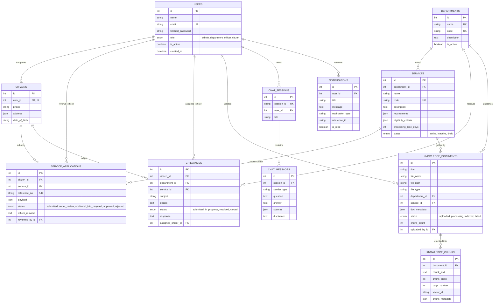

# AI-Powered Civic Service, Application and Grievance Assistant

**BCA(H) Capstone Project | Python, FastAPI & AI Engineering | WEB SKITTERS**  
**Assigned Group: GROUP-F**

---

## 📌 1. Project Overview & Objective
The **AI-Powered Civic Service, Application and Grievance Assistant** is a production-grade FastAPI web application and retrieval-augmented generation (RAG) system. The platform empowers citizens to discover municipal procedures, verify required documents and eligibility criteria, submit tracked service applications, file civic complaints, and interact with a strictly grounded real-time civic AI assistant over WebSockets and HTTP.

### Core Objectives:
- **Grounding in Approved Content:** All procedure, eligibility, fee, and timeline answers originate solely from indexed approved department guideline documents.
- **Privacy by Design Guardrails:** Automatic redaction and rejection of sensitive identity numbers (e.g., Aadhaar / SSN) with prominent non-guarantee liability disclaimers.
- **Strict Role-Based Access Control (RBAC):** Distinct permissions for **Admin**, **Department Officer**, and **Citizen** users with strict record-level ownership isolation.
- **Auditable Workflows:** End-to-end status lifecycles with generated reference numbers (e.g., `APP-YYYYMMDD-XXXX`), status transitions, officer remarks, and timeline notification logs.

---

## 👥 2. Assigned Team & Responsibility Division (GROUP-F)

| SL | Student Name | Course | Role Responsibility |
|:--:|:-------------|:-------|:---------------------|
| 1 | **Sangita Dhua** | BCA(H) | Project setup, database architecture, authentication, RBAC, and Alembic migrations. |
| 2 | **Sagnik Saha** | BCA(H) | Department, service catalogue CRUD, JSONB schemas, and citizen profile management. |
| 3 | **Sima Mal** | BCA(H) | Application submission, reference number generator, grievance workflows, status transitions, and test suites. |
| 4 | **Arjun Adhikary** | BCA(H) | Document parsing, ChromaDB vector store, RAG pipeline, WebSocket chat, and browser web UI. |

---

## 🛠️ 3. Technology Stack

- **Backend Framework:** FastAPI 0.115+, Uvicorn, Pydantic v2
- **Database & ORM:** PostgreSQL 16+ (or SQLite fallback), SQLAlchemy 2.0 (Declarative Mapped), Alembic Migrations
- **Security & Authentication:** Passlib (Bcrypt), PyJWT (HS256 Bearer Tokens), OAuth2 Password Bearer
- **AI & RAG Engine:** LangChain, Groq API (LLaMA-3) / Retrieval-Only Mode, ChromaDB Vector Database, Sentence-Transformers
- **Real-Time Communication:** Fast WebSockets with JSON event protocol
- **Frontend UI:** Vanilla CSS (Glassmorphism design system), Responsive HTML5, Vanilla JavaScript, Google Fonts (Plus Jakarta Sans, JetBrains Mono)
- **DevOps & Quality Assurance:** Pytest, Docker, Docker Compose, GitHub Actions CI

---

## 📁 4. Project Folder Structure

```
civic-service-ai-assistant/
├── README.md
├── requirements.txt
├── .env.example
├── .gitignore
├── Dockerfile
├── docker-compose.yml
├── alembic.ini
├── pytest.ini
├── .github/
│   └── workflows/
│       └── ci.yml
├── alembic/
│   ├── env.py
│   ├── script.py.mako
│   └── versions/
│       ├── 6439cfe2ae42_initial_civic_service_tables.py
│       └── 7a18b5c92f10_add_notifications_table.py
├── app/
│   ├── main.py
│   ├── api/
│   │   ├── deps.py
│   │   └── v1/
│   │       ├── router.py
│   │       └── endpoints/
│   │           ├── auth.py
│   │           ├── users.py
│   │           ├── departments.py
│   │           ├── services.py
│   │           ├── citizens.py
│   │           ├── applications.py
│   │           ├── grievances.py
│   │           ├── documents.py
│   │           ├── chat.py
│   │           ├── notifications.py
│   │           └── health.py
│   ├── core/
│   │   ├── config.py
│   │   ├── logging.py
│   │   └── security.py
│   ├── db/
│   │   ├── base.py
│   │   ├── session.py
│   │   └── models/
│   │       ├── __init__.py
│   │       ├── user.py
│   │       ├── department.py
│   │       ├── service.py
│   │       ├── citizen.py
│   │       ├── service_application.py
│   │       ├── grievance.py
│   │       ├── knowledge_document.py
│   │       ├── knowledge_chunk.py
│   │       ├── chat_session.py
│   │       ├── chat_message.py
│   │       └── notification.py
│   ├── models/ (re-exports app.db.models)
│   ├── schemas/
│   │   ├── auth.py
│   │   ├── user.py
│   │   ├── department.py
│   │   ├── service.py
│   │   ├── citizen.py
│   │   ├── service_application.py
│   │   ├── grievance.py
│   │   ├── knowledge_document.py
│   │   ├── document.py
│   │   ├── chat.py
│   │   └── notification.py
│   ├── crud/
│   │   ├── user.py
│   │   ├── department.py
│   │   ├── service.py
│   │   ├── citizen.py
│   │   ├── service_application.py
│   │   ├── grievance.py
│   │   ├── knowledge_document.py
│   │   ├── chat.py
│   │   └── notification.py
│   ├── services/
│   │   ├── document_loader.py
│   │   ├── chunking.py
│   │   ├── embedding.py
│   │   ├── vector_store.py
│   │   ├── retriever.py
│   │   ├── prompt_builder.py
│   │   ├── rag_service.py
│   │   ├── chat_service.py
│   │   ├── application_service.py
│   │   ├── reference_service.py
│   │   └── civic_guard.py
│   ├── llm/
│   │   ├── base.py
│   │   ├── factory.py
│   │   ├── retrieval_only.py
│   │   └── groq_provider.py
│   ├── websocket/
│   │   ├── manager.py
│   │   └── chat_handler.py
│   └── static/
│       ├── chat.html
│       ├── chat.js
│       └── styles.css
├── data/
│   ├── knowledge_base/
│   │   ├── water_connection_policy.md
│   │   ├── property_tax_assessment_guideline.txt
│   │   ├── trade_license_handbook.md
│   │   ├── birth_death_registration_rules.md
│   │   ├── building_plan_sanction_charter.md
│   │   └── grievance_redressal_sop.md
│   ├── storage/
│   └── vector_index/
├── scripts/
│   ├── check_local_setup.py
│   ├── create_admin.py
│   └── ingest_knowledge_base.py
└── tests/
    ├── conftest.py
    ├── unit/
    │   ├── test_application_workflow.py
    │   ├── test_civic_guard.py
    │   ├── test_reference_service.py
    │   └── test_security.py
    └── integration/
        ├── test_applications_workflow.py
        ├── test_auth_and_rbac.py
        ├── test_departments_and_services.py
        ├── test_documents_and_reindexing.py
        ├── test_grievances_workflow.py
        ├── test_notifications.py
        └── test_rag_and_chat.py
```

---

## 🗄️ 5. Database Entity-Relationship (ER) Diagram



---

## 🚀 6. Step-by-Step Local Setup & Execution

### Step 1: Clone Repository & Virtual Environment
```bash
git clone <repository_url>
cd civic-service-ai-assistant

# Create Python virtual environment
python -m venv venv

# Activate (Windows PowerShell)
.\venv\Scripts\Activate.ps1
# Activate (Linux / macOS)
source venv/bin/activate

# Install dependencies
pip install -r requirements.txt
```

### Step 2: Configure Environment Variables
```bash
cp .env.example .env
# Open .env and adjust PostgreSQL credentials or Groq API keys if desired
```

### Step 3: Run Setup Verification & Alembic Migrations
```bash
# Check local directories and DB connectivity
python scripts/check_local_setup.py

# Run database migrations
alembic upgrade head
```

### Step 4: Seed Initial Users & Ingest Knowledge Base
```bash
# Seed Admin, Department Officer, Citizen users & 5 core services
python scripts/create_admin.py

# Index all approved guidelines into ChromaDB vector store
python scripts/ingest_knowledge_base.py
```

### Step 5: Start FastAPI Server
```bash
uvicorn app.main:app --reload --host 127.0.0.1 --port 8000
```

### Step 6: Access Interfaces
- **Interactive Web Portal:** [http://127.0.0.1:8000/static/chat.html](http://127.0.0.1:8000/static/chat.html)
- **Interactive Swagger UI:** [http://127.0.0.1:8000/docs](http://127.0.0.1:8000/docs)
- **ReDoc:** [http://127.0.0.1:8000/redoc](http://127.0.0.1:8000/redoc)
- **Health Check:** [http://127.0.0.1:8000/api/v1/health](http://127.0.0.1:8000/api/v1/health)

---

## 🐳 7. Docker & Docker Compose Setup

Run the entire application stack (FastAPI + PostgreSQL + ChromaDB) in isolated containers:

```bash
# Build and run containers
docker-compose up --build -d

# View container logs
docker-compose logs -f app

# Run database migrations inside container
docker-compose exec app alembic upgrade head

# Seed initial data
docker-compose exec app python scripts/create_admin.py
docker-compose exec app python scripts/ingest_knowledge_base.py

# Run test suite in container
docker-compose exec app pytest -q

# Stop containers
docker-compose down
```

---

## 🧪 8. Automated Test Suite Execution

Run the complete test suite:
```bash
# Run all tests with verbose reporting
pytest -v

# Run with concise output
pytest -q
```
*Current test suite includes 19 automated tests validating authentication, RBAC, record-level ownership isolation, application status transitions, grievance workflows, vector similarity search, RAG grounding, and real-time WebSockets.*

---

## 🎓 9. Live Classroom Demo Sequence (18-Step Walkthrough)

To present the project in accordance with **Page 10** of the Capstone specification:

1. **Folder Structure & .env.example:** Show project directory layout and security settings.
2. **Start Services:** Start PostgreSQL and launch `uvicorn app.main:app --reload`.
3. **Swagger Health Check:** Open `/docs` and invoke `GET /api/v1/health` (verify `"status": "healthy"`).
4. **Register & Login:** Authenticate as Citizen or Officer at `/api/v1/auth/login` and obtain JWT token.
5. **Create Department & Service:** Demonstrate `POST /api/v1/departments/` (Admin) and `POST /api/v1/services/` (Officer).
6. **Citizen Profile:** View `GET /api/v1/citizens/me` with address JSON payload.
7. **Submit Service Application:** Submit `POST /api/v1/applications/` and verify generated tracking ID (e.g. `APP-20260906-8921`).
8. **Controlled Status Update:** Log in as Officer, update application from `SUBMITTED` -> `UNDER_REVIEW` -> `APPROVED` via `PUT /api/v1/applications/{id}/status`.
9. **Lodge Grievance & Officer Response:** Submit `POST /api/v1/grievances/` and respond via `PUT /api/v1/grievances/{id}/respond`.
10. **Upload Approved Guideline:** Upload sample policy via `POST /api/v1/documents/upload`.
11. **Run Knowledge Indexing:** Trigger `python scripts/ingest_knowledge_base.py` or reindex endpoint.
12. **Ask Supported Question:** Query *"What mandatory documents are required for a water connection?"*.
13. **Verified Sources & Disclaimer:** Observe answer with citation chip (document name, page number) and legal disclaimer.
14. **Cross-Citizen Ownership Isolation:** Attempt to view Citizen 1's application using Citizen 2's token (observe **HTTP 403 Forbidden**).
15. **Anti-Guarantee Guardrail:** Ask *"Can you guarantee my commercial license will be approved tomorrow?"* -> Observe safe, ungrounded no-answer response.
16. **WebSocket Browser UI:** Open `/static/chat.html` to demonstrate live streaming chat, real-time typing indicators, and the visual timeline tracker.
17. **Run Pytest:** Execute `pytest -q` in the terminal to verify all 19 tests pass cleanly.
18. **Explain Docker Deployment:** Present `Dockerfile` and `docker-compose.yml` multi-container architecture.

---

## 📝 10. One-Page Group Contribution Note

### Student 1: Sangita Dhua (Roll / ID: Group-F-1)
- **Modules Implemented:** Core application setup, logging subsystem (`app/core/logging.py`), security and JWT utility (`app/core/security.py`), base database classes (`app/db/base.py`), User models, authentication endpoints (`/auth/register`, `/auth/login`, `/auth/token`), RBAC dependency filters (`app/api/deps.py`), and complete Alembic database migrations.
- **Testing:** Implemented unit tests for password hashing, JWT encoding/decoding, expiration handling, and integration tests for authentication and role elevation protection.

### Student 2: Sagnik Saha (Roll / ID: Group-F-2)
- **Modules Implemented:** Department and Service Catalogue models (`app/db/models/department.py`, `service.py`), Pydantic JSON validation schemas with required documents and eligibility criteria JSONB fields, CRUD operations (`app/crud/department.py`, `service.py`, `citizen.py`), and Citizen profile management endpoints (`/citizens/me`, `/citizens/{id}`).
- **Testing:** Implemented integration tests for department lifecycle, service code uniqueness, and public catalogue search/filtering.

### Student 3: Sima Mal (Roll / ID: Group-F-3)
- **Modules Implemented:** Service Application workflow engine (`app/services/application_service.py`), reference number generator (`app/services/reference_service.py`), Grievance lifecycle models and endpoints (`app/api/v1/endpoints/applications.py`, `grievances.py`), officer response workflows, notification logging (`app/crud/notification.py`), and record-level ownership isolation guards.
- **Testing:** Implemented unit tests for valid/invalid status state transitions, reference formatting, and cross-citizen privacy violation rejection tests (HTTP 403).

### Student 4: Arjun Adhikary (Roll / ID: Group-F-4)
- **Modules Implemented:** Document loader (`app/services/document_loader.py` for PDF/DOCX/TXT/MD), chunking and embedding services, ChromaDB vector store integration (`app/services/vector_store.py`), retriever service, prompt builder with multilingual instructions, civic guard privacy sanitizer (`app/services/civic_guard.py`), WebSocket connection manager (`app/websocket/`), and the full interactive browser interface (`chat.html`, `chat.js`, `styles.css`).
- **Testing:** Implemented RAG grounding verification tests, ungrounded inquiry fallback tests, Aadhaar redaction unit tests, and WebSocket real-time event tests.

---

## 💡 11. Viva Preparation: 10 Core Questions & Model Answers

#### Q1: What problem does this project solve, and who are its users?
> **Answer:** It solves information opacity, slow application turnaround, and unstructured grievance filing in public administration. Its users are: (1) **Citizens**, who need verified procedural guidelines, tracking, and instant answers; (2) **Department Officers**, who review applications, post grievance resolutions, and upload approved service charters; and (3) **System Administrators**, who oversee user accounts, departments, and system health.

#### Q2: Why is FastAPI suitable for this backend?
> **Answer:** FastAPI provides high asynchronous performance (built on Starlette and ASGI), automatic Pydantic v2 data validation, native WebSocket support for real-time chat, dependency injection for clean RBAC, and auto-generated OpenAPI/Swagger documentation (`/docs`), which streamlines team development and testing.

#### Q3: Why are Pydantic schemas separated from SQLAlchemy models?
> **Answer:** SQLAlchemy models define the database schema, table relationships, foreign keys, and ORM persistence state. Pydantic schemas define the API data transfer contract (request validation, response serialization, password exclusion, and data type coercion). Separating them prevents internal database details from leaking to clients and prevents mass-assignment security vulnerabilities.

#### Q4: How does JWT authentication work in the project?
> **Answer:** When a user logs in with email and password, the server verifies the Bcrypt password hash and generates a signed JSON Web Token (JWT) containing standard claims (`sub` with user ID, `role`, `email`, and expiration timestamp). On subsequent requests, the client transmits this token in the `Authorization: Bearer <token>` header, which the `get_current_user` dependency validates without requiring session state on the server.

#### Q5: How is role-based access enforced?
> **Answer:** Role-Based Access Control is enforced through reusable FastAPI dependencies using the `RoleChecker` class in `app/api/deps.py`. For example, `require_admin` ensures only users with the `admin` role can create departments or delete services, while `require_officer_or_admin` protects document uploads and status update endpoints.

#### Q6: What are chunking, embeddings, and vector search?
> **Answer:**
> - **Chunking:** Splitting large guideline documents into manageable text segments (e.g. 500 characters with 80 character overlap) while preserving semantic boundaries.
> - **Embeddings:** Passing chunk text through a neural model to convert textual meaning into dense numerical vectors (arrays of floats).
> - **Vector Search:** Calculating mathematical distance (cosine or Euclidean similarity) between the user question's vector and indexed document vectors in ChromaDB to retrieve the most relevant snippets in milliseconds.

#### Q7: How does the RAG pipeline prevent unsupported answers?
> **Answer:** (1) The retriever fetches only top-$K$ approved document chunks; (2) if similarity is below threshold or no snippets match, the pipeline immediately triggers a safe no-answer fallback; (3) the system prompt explicitly restricts the LLM to answer *strictly* using the provided context; and (4) the prompt prohibits guaranteeing application outcomes or providing legal advice.

#### Q8: Why are source references returned with the chatbot answer?
> **Answer:** Returning source references (document title, page number, and snippet) provides civic transparency, builds citizen trust, enables verification against official records, and prevents hallucinations by proving exactly which approved guideline was referenced.

#### Q9: How do Alembic migrations help the team?
> **Answer:** Alembic enables version-controlled database schema evolution. It allows every team member and deployment environment to recreate the exact database structure from scratch (`alembic upgrade head`), track changes through migration history files, and roll back breaking changes without manual SQL scripts.

#### Q10: Which tests prove that the main workflow works correctly?
> **Answer:**
> - `test_service_application_workflow_and_isolation`: Tests submission, reference number format (`APP-YYYYMMDD-XXXX`), status transitions, and ensures Citizen B cannot view Citizen A's records (HTTP 403).
> - `test_valid_status_transitions` & `test_invalid_status_transitions`: Proves status workflow integrity.
> - `test_rag_grounding_and_chat_sessions`: Proves supported questions return grounded answers with sources, while unindexed questions return safe no-answer responses.
> - `test_notification_feed_and_read_status`: Proves notifications are recorded on status transitions.

---

## ✅ 12. Final Acceptance Checklist

| Requirement Checkpoint | Status | Verification Detail |
|:---|:---:|:---|
| Starts from documented commands | **PASSED** | Validated locally and via `docker-compose up` |
| No secrets/passwords hardcoded | **PASSED** | Managed strictly via `.env` and `.env.example` |
| Protected routes enforce RBAC | **PASSED** | Admin, Officer, and Citizen role constraints active |
| CRUD validation returns clear HTTP errors | **PASSED** | 400 Bad Request on invalid payloads / 404 on missing entities |
| Chatbot rejects unindexed inquiries | **PASSED** | Returns standard no-answer response without hallucinating |
| Usable source references included | **PASSED** | Returns document title, file name, and page citations |
| `pytest -q` completes without failures | **PASSED** | 19 / 19 tests passing |
| Complete folder structure compliance | **PASSED** | Matches Capstone specification pages 7–9 |

---

*AI-Powered Civic Service, Application and Grievance Assistant • GROUP-F Capstone Submission*
